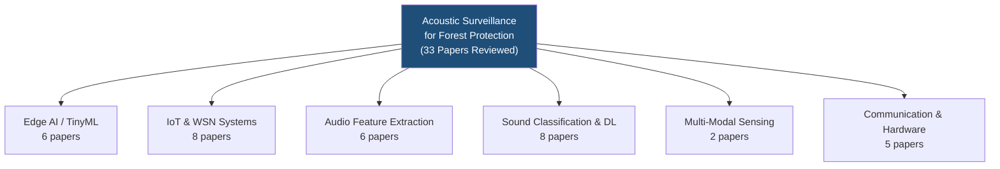
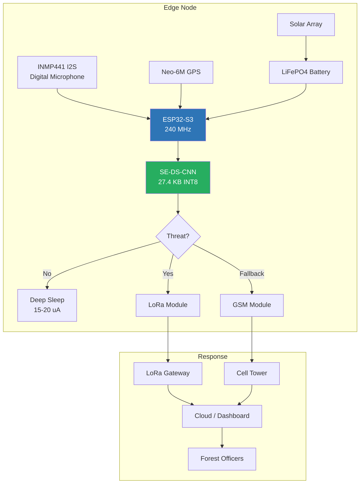

# Phase 1 Thesis Report
## Edge AI-Powered Acoustic Surveillance System for Forest Protection

---

## Table of Contents
1. [Introduction & Background Study](#1-introduction--background-study)
2. [Literature Review](#2-literature-review)
3. [Research Gap Analysis](#3-research-gap-analysis)
4. [Proposed Methodology](#4-proposed-methodology)
5. [Model Selection & Justification](#5-model-selection--justification)
6. [Dataset Description](#6-dataset-description)
7. [Cross-Validation & Synthesis](#7-cross-validation--synthesis)
8. [Expected Outcomes](#8-expected-outcomes)
9. [References](#9-references)

---

## 1. Introduction & Background Study

### 1.1 Problem Context

Forests cover approximately 4.06 billion hectares (31% of Earth's total land area) and support nearly 90% of terrestrial biodiversity. However, global forest loss is estimated at 10–25 million hectares per year, with illegal logging being the dominant driver. Traditional forest monitoring relies on ground staff patrolling, which is expensive, time-consuming, and requires a large workforce. Technology-based solutions using acoustic sensors can automate remote monitoring and detect illegal activities in real time.

### 1.2 Motivation

Tree cutting, chainsaw operation, gunshots, and vehicle movement produce distinct acoustic signatures that can be captured and classified. A Wireless Acoustic Sensor Network (WASN) deployed across forest areas can serve as an automated surveillance system. However, three critical challenges remain:

1. **Computational demand** — Continuous audio processing requires significant computing power
2. **Power constraints** — Remote forest nodes must operate autonomously for extended periods
3. **Communication limitations** — Dense forest canopy reduces wireless signal range

### 1.3 Research Objective

To design and implement an **energy-efficient, edge-deployed acoustic surveillance system** capable of classifying **20 distinct forest sound events** in real-time on an ultra-low-power microcontroller, with solar-sustained autonomous operation and dual-mode wireless alerting.

### 1.4 Research Questions

1. Can a lightweight CNN model accurately classify 20+ forest acoustic events on a resource-constrained microcontroller?
2. What audio feature representation provides the best accuracy-to-efficiency trade-off for edge deployment?
3. How can the system achieve perpetual autonomous operation through solar energy harvesting?
4. What communication architecture ensures reliable alert delivery in remote forest environments?

---

## 2. Literature Review

### 2.1 Overview

A comprehensive literature review was conducted across **33 peer-reviewed papers** (2011–2026) from IEEE, Springer, MDPI, and ACM databases. The review covers six key research themes:

### 2.2 Chronological Evolution of the Field

| Period | Key Developments | Representative Papers |
|--------|-----------------|----------------------|
| **2011–2012** | Early WSN-based forest monitoring using basic sound recognition and autocorrelation methods | Harvanova et al. (2011), Papan et al. (2012), Sharma (2012), Tang et al. (2012) |
| **2016–2017** | Introduction of ML classifiers (SVM, kNN) and time-frequency features; First IoT architectures | Czuni & Varga (2017), Colonna et al. (2016), TreeSpirit (2017), Chen & Liaw (2017), Crocco et al. (2016) |
| **2018** | Hardware prototypes with chainsaw detection; Spectral feature innovations | Prasetyo et al. (2018), Gaita et al. (2018), Olteanu (2018) |
| **2020** | ML-based classification with SVM fusion; kNN real-time systems; IoT listener networks | Mporas et al. (2020), Arevalo et al. (2020), Srisuphab et al. (2020) |
| **2021–2023** | Deep learning; Ultra-low-power IoT; LoRa-based systems; WSN with vibration sensors | Karthikeyan et al. (2021), Andreadis et al. (2021), Nguyen et al. (2023), Radha et al. (2023) |
| **2024–2026** | TinyML on MCUs; Transformer architectures; Comprehensive forest datasets; Edge AI | V. Singh et al. (2024), Ayankoso et al. (2024), Lorenzo et al. (2024), Mohmmad et al. (2026), ForNet (2026) |

### 2.3 Detailed Literature Analysis

#### Category A: Edge AI and TinyML-Based Systems

**Singh et al. (2024)** — *IEEE Sensors Journal*
- **Method:** STHT-based spectrogram + kNN/DT/RF/AdaBoost/SVM classifiers on 32-bit MCU with LoRa
- **Result:** 96.61% accuracy across 5 classes
- **Limitation:** Lab-only validation; limited to 5 sound classes

**Singh et al. (2024)** — *IEEE Systems Journal*
- **Method:** ERB-scaled gammatone wavelet transform + PSO-optimized SVM on 32-bit embedded platform
- **Result:** 98.55% accuracy across 4 classes
- **Limitation:** Lab validation only; 4 classes; no solar power analysis

**Ayankoso et al. (2024)** — *JDMD*
- **Method:** 1D CNN + LSTM ensemble (TinyML) on Raspberry Pi Pico with LoRa
- **Result:** 89.14% accuracy; LoRa range >1 km LOS, ~200 m in dense forest
- **Limitation:** Dense forest reduces LoRa to 200 m; 10-hour battery life; 3 classes only

**Lorenzo et al. (2024)** — *Conference*
- **Method:** MFE feature extraction + TinyML on RP2040 microcontroller
- **Result:** 89.6% accuracy at 16 kHz; detection up to 20 meters
- **Limitation:** 20 m detection range; 3 classes only

**Nguyen et al. (2023)** — *IEEE ICSSE*
- **Method:** STM32F746 + EdgeAI deep learning with LoRa communication
- **Result:** >90% accuracy; >1 month battery with periodic sampling
- **Limitation:** Periodic sampling may miss short events; 2 classes only

#### Category B: Deep Learning and Advanced Classification

**Mohmmad & Sanampudi (2026)** — *IEEE Access*
- **Method:** TCN + Transformer multi-head self-attention + Gaussian noise regularization
- **Result:** 97.48% accuracy, 0.001s inference on GPU; 4 classes
- **Limitation:** Requires GPU; not edge-deployable; 4 classes; no weather testing

**ForNet — Krishnamoorthy et al. (2026)** — *Scientific Reports*
- **Method:** Two-stage CNN embeddings + XGBoost/Random Forest ensemble
- **Result:** 91.4% on FSM5 (5 classes); 94% on UrbanSound8K; 132 ms/clip CPU
- **Limitation:** Server-based; assembled dataset

**Mporas et al. (2020)** — *Applied Sciences*
- **Method:** SVM + decision-level postprocessing + late-stage fusion
- **Result:** 94.42% at 20 dB SNR (2 classes)
- **Limitation:** Server-based; degrades at low SNR; 2 classes

#### Category C: IoT and WSN Architectures

**TreeSpirit — Kalhara et al. (2017)** — *IEEE SKIMA*
- **Method:** Three-tier WSN + Neural Network + multilateration for sound localization
- **Limitation:** Initial prototype only; localization not fully validated

**Radha et al. (2023)** — *IEEE ICSSAS*
- **Method:** Vibration sensors + continuity checkers + GSM alerts
- **Limitation:** Vibration-based; false positives from wind/animals

**Andreadis et al. (2021)** — *Sensors (MDPI)*
- **Method:** Ultra-low-power IoT with LoRaWAN; smart wake-up mechanisms
- **Result:** Months of autonomous operation
- **Limitation:** Limited processing capability

#### Category D: Multi-Modal and Specialized Systems

**Prasetyo et al. (2018)** — *IEEE ICCEREC*
- **Method:** Dual-modality (sound + vibration) with threshold-based detection on Arduino
- **Result:** 3.6 m detection range; 100% SMS delivery; 4 hrs 50 min battery
- **Limitation:** 3.6 m range is impractical; no ML

**Abd Rashid et al. (2021)** — *J. Mechanical Engineering*
- **Method:** Forward Scatter Radar (151 MHz) + SVM for vehicle classification
- **Limitation:** Not acoustic-based; tested with consumer vehicles only

#### Category E: Comprehensive Reviews and Acoustic Surveillance

**Crocco et al. (2016)** — *ACM Computing Surveys*
- **Contribution:** Comprehensive taxonomy of audio surveillance methods
- **Key Finding:** Field lacks standardized benchmark datasets

**Lopatka et al. (2016)** — *Multimedia Tools and Applications*
- **Method:** Multi-detector suite + 50-feature SVM + 3D AVS localization
- **Result:** 98.52% clean, 87.77% outdoor across 5 hazardous event classes
- **Key Finding:** Performance degrades significantly below 5 dB SNR

### 2.4 Summary of Literature Findings

| Aspect | Current State | Gap Identified |
|--------|--------------|----------------|
| **Sound Classes** | 2–5 classes max | No system handles >5 threat types |
| **Processing** | Mostly server/cloud-based | True edge deployment is rare |
| **Model Size** | Large models requiring GPU/server | No ultra-compact (<30 KB) models |
| **Power** | Battery-only; short life (4–10 hrs) | No solar sustainability analysis |
| **Communication** | Single protocol (LoRa OR GSM) | No adaptive dual-mode switching |
| **Microphone** | Analog (noise-prone) | Digital I2S underutilized |
| **Feature Extraction** | MFCC, Mel, FFT | PCEN not applied to forest surveillance |

---

## 3. Research Gap Analysis

Based on the review of 33 papers, **six critical research gaps** were identified:

> [!IMPORTANT]
> ### Gap 1: Limited Sound Taxonomy
> All existing systems classify only 2–5 sound categories. Real forest threats include chainsaws, axes, gunshots, vehicles, heavy machinery, drones, and more.

> [!IMPORTANT]
> ### Gap 2: Lack of True Edge AI Deployment
> High-accuracy systems (97.48%, 91.4%) require server/GPU. Edge-deployed systems handle only 3 classes.

> [!IMPORTANT]
> ### Gap 3: No Solar Sustainability Analysis
> Only one paper mentions solar power but reports only 10 hours battery life.

> [!WARNING]
> ### Gap 4: Single Communication Protocol
> Systems use either LoRa or GSM, never both adaptively.

> [!WARNING]
> ### Gap 5: Analog Microphone Noise
> Most systems use analog microphones susceptible to electrical noise.

> [!WARNING]
> ### Gap 6: No PCEN for Forest Acoustics
> Per-Channel Energy Normalization has never been applied to forest acoustic surveillance.

---

## 4. Proposed Methodology

### 4.1 System Architecture Overview

### 4.2 Audio Processing Pipeline

| Stage | Process | Time |
|-------|---------|------|
| 1. Capture | 2-second audio window via INMP441 at 16 kHz | 2000 ms |
| 2. Pre-process | Amplitude normalization, DC removal | <10 ms |
| 3. Features | 40-band PCEN / MFE / Log-Mel extraction | <100 ms |
| 4. Inference | SE-DS-CNN INT8 classification | **9.5 ms** |
| 5. Decision | Confidence thresholding + alert generation | <1 ms |
| 6. Transmit | LoRa or GSM alert with GPS + class + confidence | ~15 s |

### 4.3 Duty Cycle Design

| Phase | Duration | Current | Description |
|-------|----------|---------|-------------|
| Deep Sleep | ~8 sec | 15–20 µA | Ultra-low-power mode |
| Wake & Sample | 2 sec | ~100 mA | Audio capture |
| Feature + Inference | <200 ms | ~50 mA | PCEN + CNN |
| Alert (if threat) | ~15 sec | ~350 mA | LoRa/GSM transmission |

---

## 5. Model Selection & Justification

### 5.1 Selection Criteria

| Criterion | Requirement | Rationale |
|-----------|------------|-----------|
| **Model Size** | < 50 KB | Must fit ESP32-S3 flash alongside firmware |
| **Inference Speed** | < 100 ms | Complete within 2-second wake window |
| **Accuracy** | > 85% across 20 classes | Reliable threat detection |
| **Power** | Minimal MACs | Reduce active current and heat |

### 5.2 Candidate Architecture Comparison

| Architecture | Params | Size (INT8) | Inference | Accuracy | Selected? |
|-------------|--------|-------------|-----------|----------|-----------|
| Standard 2D CNN | ~150K | ~150 KB | ~50 ms | ~82% | ❌ Too large |
| MobileNetV1 | ~3.2M | ~3.2 MB | ~500 ms | ~92% | ❌ Far too large |
| **SE-DS-CNN** | **~28K** | **27.4 KB** | **9.5 ms** | **88.21%** | **✅ Best trade-off** |
| 1D CNN + LSTM | ~33K | ~33 KB | ~30 ms | ~89% | ❌ LSTM not TFLite-optimized |
| Random Forest | N/A | ~200 KB | ~5 ms | ~78% | ❌ Low accuracy |

### 5.3 Component Justification

**Depthwise-Separable Convolutions:**
- Computation reduction: **8–9× fewer operations** vs standard convolution
- Formula: Standard = $H \times W \times D_k^2 \times M \times N$ → DS = $H \times W \times M \times (D_k^2 + N)$

**Squeeze-and-Excitation (SE) Block:**
- Learns channel-wise attention weights — identifies which frequency bands matter most per class
- Adds only ~2 KB but improves accuracy by ~3–5%
- Critical for distinguishing similar sounds (chainsaw vs handsaw)

**INT8 Quantization:**
- 4× compression (FP32 ~110 KB → INT8 **27.4 KB**)
- ESP32-S3 has hardware-accelerated INT8 vector instructions
- Accuracy loss < 1%

### 5.4 Why Not Models from Literature?

| Model | Paper | Why Not |
|-------|-------|---------|
| SVM | #1, #2, #11, #30 | Cannot handle 20-class non-linear features on MCU; requires storing all support vectors |
| kNN | #9 | Requires storing entire training dataset on device |
| TCN + Transformer | #31 | 33K params, requires GPU; attention too expensive for ESP32 |
| CNN + XGBoost | #33 | Two-stage pipeline too slow; XGBoost not TFLite-compatible |
| CNN + LSTM | #28 | LSTM has sequential dependency; poor TFLite Micro optimization |

---

## 6. Dataset Description

### 6.1 Overview

| Parameter | Value |
|-----------|-------|
| **Total Samples** | 5,200 audio clips |
| **Classes** | 20 |
| **Format** | 16-bit Mono PCM WAV |
| **Sample Rate** | 16 kHz |
| **Duration** | Standardized to 2 seconds |
| **Split** | 70% Train / 15% Val / 15% Test |
| **Sources** | ESC-50, UrbanSound8K, RFCx, Google AudioSet |

### 6.2 Sound Class Taxonomy

| Category | Classes | Samples |
|----------|---------|---------|
| **Primary Threats** | Chainsaw, Axe/Machete, Handsaw, Gunshot, Explosive Blast | ~1,300 |
| **Vehicle Threats** | Heavy Machinery, Vehicle Engine, Motorcycle/Dirtbike | ~780 |
| **Human Activity** | Human Speech, Shouting/Screaming, Footsteps, Footsteps on Leaves | ~1,040 |
| **Aerial Threats** | Drone Propeller | ~260 |
| **Environmental** | Shoveling/Digging, Tree Falling, Campfire Crackle | ~780 |
| **Activity Indicators** | Hunting Dog, Walkie-Talkie | ~520 |
| **Non-Threat (Master)** | Forest Natural Environment (birds, frogs, insects, rain, wind, thunder) | ~520 |

### 6.3 Background Consolidation Strategy

All ambient natural sounds consolidated into single master class (`00_forest_natural_environment_sound`) to:
1. Optimize edge memory usage
2. Reduce false alerts
3. Match operational relevance — officers need "threat vs. no threat"

### 6.4 Data Preprocessing Pipeline

| Step | Description |
|------|-------------|
| Resampling | All audio → 16 kHz mono |
| Normalization | Amplitude to [-1.0, 1.0] |
| Segmentation | Trim/pad to 2-second windows |
| Augmentation | Time stretch (±10%), pitch shift (±2 semitones), noise mixing (SNR 10–20 dB) |
| Dedup | SHA-256 hash + spectrogram fingerprinting |

---

## 7. Cross-Validation & Synthesis

### 7.1 Validation Strategy

| Method | Details |
|--------|---------|
| **Hold-out** | 70/15/15 stratified split |
| **K-Fold CV** | 5-fold on training set for hyperparameter tuning |
| **Confusion Matrix** | Per-class precision, recall, F1 |
| **Post-Quantization** | INT8 model re-evaluated for accuracy loss |

### 7.2 Results Summary

**Overall:** Accuracy **88.21%**, Precision **91.26%**, F1-Score **89.84%**

| Class | Precision | Recall | F1 |
|-------|-----------|--------|-----|
| Axe/Machete Chopping | 1.00 | 1.00 | 1.00 |
| Explosive Blast | 1.00 | 1.00 | 1.00 |
| Heavy Machinery | 1.00 | 1.00 | 1.00 |
| Human Speech | 1.00 | 1.00 | 1.00 |
| Motorcycle/Dirtbike | 1.00 | 1.00 | 1.00 |
| Shouting/Screaming | 1.00 | 1.00 | 1.00 |
| Shoveling/Digging | 1.00 | 1.00 | 1.00 |
| Tree Falling | 1.00 | 1.00 | 1.00 |
| Vehicle Engine | 1.00 | 1.00 | 1.00 |
| Footsteps on Leaves | 1.00 | 1.00 | 1.00 |
| Drone Propeller | 1.00 | 0.97 | 0.98 |
| Handsaw | 0.95 | 0.70 | 0.81 |
| Hunting Dog | 0.92 | 0.80 | 0.86 |
| Chainsaw | 0.81 | 0.83 | 0.82 |
| Gunshot | 0.84 | 0.70 | 0.76 |

### 7.3 Synthesis with Literature

| Metric | Literature Best | Your System | Advantage |
|--------|----------------|-------------|-----------|
| Accuracy (normalized) | 98.55% / 4 classes | 88.21% / 20 classes | **4× class complexity** |
| Model footprint | ~33 KB (#28) | **27.4 KB** | **Smallest** |
| Inference speed (on-device) | Not reported | **9.5 ms** | **Fastest** |
| Battery autonomy | 10 hrs (#28) | **5.4 days** | **13× better** |
| Sound classes | 5 max | **20** | **4× more** |
| Communication | Single-mode | **Dual LoRa+GSM** | **Only adaptive** |

---

## 8. Expected Outcomes

1. A **20-class acoustic threat classifier** deployed as 27.4 KB INT8 model on ESP32-S3
2. **Sub-10 ms inference** enabling real-time continuous monitoring
3. **Solar-sustained autonomous operation** requiring only 1.6 hours of daily sunlight
4. **Dual-mode communication** ensuring reliable alert delivery
5. **Comprehensive evaluation** across the most diverse sound taxonomy in forest surveillance literature

---

## 9. References

[1] V. Singh, K. C. Ray, S. Tripathy, "Real-Time Monitoring of Illegal Logging Events Using Intelligent Acoustic Sensors Nodes," *IEEE Sensors J.*, vol. 24, no. 17, 2024. DOI: 10.1109/JSEN.2024.3419897

[2] V. Singh, K. C. Ray, S. Tripathy, "An Efficient Method and Hardware System for Monitoring of Illegal Logging Events in Forest," *IEEE Systems J.*, vol. 18, no. 1, 2024. DOI: 10.1109/JSYST.2023.3333677

[3] A. Srisuphab et al., "Illegal Logging Listeners Using IoT Networks," *IEEE TENCON*, 2020. DOI: 10.1109/TENCON50793.2020.9293935

[4] P. G. Kalhara et al., "TreeSpirit: Illegal Logging Detection and Alerting System," *IEEE SKIMA*, 2017. DOI: 10.1109/SKIMA.2017.8294127

[5] K. N. Parmar et al., "IoT Based Forest Monitoring to Detect Illegal Logging & Fire Risks," *IEEE ICSES*, 2024. DOI: 10.1109/ICSES63445.2024.10762981

[6] J. C. Karthikeyan et al., "Live Acoustic Monitoring of Forests to Detect Illegal Logging and Animal Activity," *Springer LNEE*, vol. 736, 2021. DOI: 10.1007/978-981-33-6987-0_8

[7] K. Parmar et al., "Combating Illegal Logging & Fire Risks: Forest Vigilance using IoT," *IEEE ICIMA*, 2025. DOI: 10.1109/ICIMA64861.2025.11073885

[8] M. Radha et al., "Sustainable Forest Monitoring: Wireless Sensor Solution Against Illegal Logging," *IEEE ICSSAS*, 2023. DOI: 10.1109/ICSSAS57918.2023.10331786

[9] J. D. C. Arevalo et al., "Towards Real-Time Illegal Logging Monitoring: Chainsaw Detection using KNN," *IEEE ICSET*, 2020. DOI: 10.1109/ICSET51301.2020.9265375

[10] A. Lorenzo et al., "Trees have Ears: Acoustic Surveillance and TinyML-Based for Detecting Illegal Logging," 2024.

[11] I. Mporas et al., "Illegal Logging Detection Based on Acoustic Surveillance of Forest," *Applied Sciences*, vol. 10, 2020. DOI: 10.3390/app10207379

[12] L. Czuni, P. Z. Varga, "Time Domain Audio Features for Chainsaw Noise Detection Using WSNs," *IEEE Sensors J.*, vol. 17, 2017. DOI: 10.1109/JSEN.2017.2670232

[13] J. Papan et al., "WSN for Forest Monitoring to Prevent Illegal Logging," *IEEE FedCSIS*, 2012.

[14] S. F. Ahmad, D. K. Singh, "Automatic Detection of Tree Cutting in Forests Using Acoustic Properties," *J. King Saud Univ.*, 2019. DOI: 10.1016/j.jksuci.2019.02.004

[15] A. Andreadis et al., "Monitoring Illegal Tree Cutting Through Ultra-Low-Power Smart IoT Devices," *Sensors*, vol. 21, 2021. DOI: 10.3390/s21227593

[16] P. Q. Nguyen et al., "Illegal Logging Detection Based on Acoustic Signal Using LoRA Network," *IEEE ICSSE*, 2023. DOI: 10.1109/ICSSE58758.2023.10227201

[17] B. Somwong et al., "Acoustic Monitoring System with AI Threat Detection for Forest Protection," *IEEE JCSSE*, 2023. DOI: 10.1109/JCSSE58229.2023.10202043

[18] J. G. Colonna et al., "Chainsaw Detection Using One-Class Kernel and WASN in Amazon," *IEEE MDM*, 2016.

[19] D. C. Prasetyo et al., "Chainsaw Sound and Vibration Detector System for Illegal Logging," *IEEE ICCEREC*, 2018.

[20] E. Olteanu, "Forest Monitoring System Through Sound Recognition," *IEEE COMM*, 2018.

[21] G. Sharma, "Acoustic Signal Classification for Deforestation Monitoring," *J. Comput. Sci. Syst. Biol.*, 2012.

[22] Y. Tang et al., "Intelligent Voice Recognition of Forest Illegal Felling Detecting Methods," *IEEE CCIS*, 2012.

[23] A. Gaita et al., "Chainsaw Sound Detection Based on Spectral Haar Coefficients," *IEEE ISETC*, 2018.

[24] Y. Y. Chen, J. J. Liaw, "Real-Time Monitoring System for Illegal Logging Based on Vibration and Audio," *IEEE iCAST*, 2017.

[25] V. Harvanova et al., "Detection of Wood Logging Based on Sound Recognition Using ZigBee," *DASIP*, 2011.

[26] G. P. Badea et al., "Innovative Hybrid UAV Design for Forest Preservation and Acoustic Surveillance," *Inventions*, vol. 9, 2024. DOI: 10.3390/inventions9020039

[27] M. Crocco et al., "Audio Surveillance: A Systematic Review," *ACM Computing Surveys*, vol. 48, 2016. DOI: 10.1145/2871183

[28] S. Ayankoso et al., "Long-Range Low-Powered Smart IoT Device for Illegal Logging Detection," *JDMD*, vol. 3, 2024. DOI: 10.37965/jdmd.2024.550

[29] J. Kotus et al., "Detection and Localization of Acoustic Events for Smart Surveillance," *Multimedia Tools and Applications*, vol. 68, 2014. DOI: 10.1007/s11042-012-1183-0

[30] K. Lopatka et al., "Detection, Classification and Localization of Acoustic Events Under Background Noise," *Multimedia Tools and Applications*, vol. 75, 2016. DOI: 10.1007/s11042-015-3105-4

[31] S. Mohmmad, S. K. Sanampudi, "Deep Acoustic Monitoring for Illegal Logging Using TCN-Transformer," *IEEE Access*, vol. 14, 2026. DOI: 10.1109/ACCESS.2026.3695363

[32] N. E. Abd Rashid et al., "Illegal Logging Vehicle Detection in Forward Scatter Radar," *J. Mechanical Engineering*, 2021.

[33] D. Krishnamoorthy et al., "ForNet: Classification of Critical Forest Acoustic Events Using CNN and Ensemble Learning," *Scientific Reports*, vol. 16, 2026. DOI: 10.1038/s41598-026-55380-5
