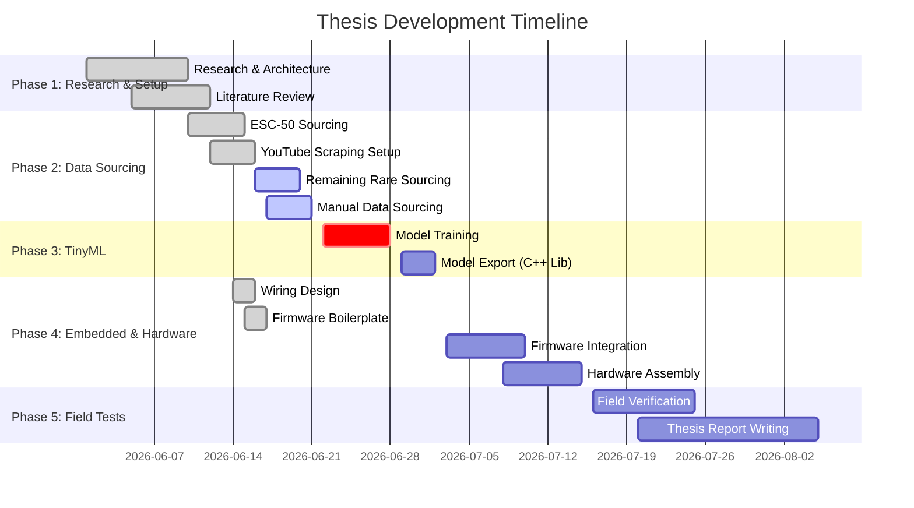

# 📊 Thesis Work Update & Progress Report

This document outlines the completed (DONE) work, active tasks (IN PROGRESS), and remaining milestones (REMAINING) for your **Edge AI-powered Forest Acoustic Surveillance System** (built on the ESP32-S3, digital I2S microphone, and SIM800L GSM).

---

## 📈 Executive Summary

*   **Total Identified Tasks**: 30
*   **Completed (DONE)**: 14 (47%)
*   **Active (IN PROGRESS)**: 3 (10%)
*   **Pending (REMAINING)**: 13 (43%)
*   **Project Workspace**: `D:\software\acoustic-surveillance`

---

## 🛠️ Detailed Task Status

### 🟢 1. Research, Architecture, & Design (100% Completed)

All fundamental physics, hardware architecture, sound catalogs, and mathematical analyses have been fully prepared.

*   **[x] End-to-End Project Plan**: Created the master thesis plan outlining directory structure, goals, and setup.
    *   📄 [README.md](file:///D:/software/acoustic-surveillance/README.md)
*   **[x] Target Acoustic Catalog**: Defined 31 target and environmental filter classes with their typical frequency ranges, temporal signatures, and dataset sources.
    *   📄 [sound_classes.md](file:///D:/software/acoustic-surveillance/sound_classes.md)
*   **[x] Sub-Class Taxonomy**: Created detailed acoustic profiles for sub-classes (gas vs. electric chainsaws, rifle vs. handgun vs. shotgun, etc.) and excluded boat engine classes per specifications.
    *   📄 [sub_classes.md](file:///D:/software/acoustic-surveillance/sub_classes.md)
*   **[x] Physics & Signal Processing Guide**: Documented forest acoustic propagation physics (geometric spreading, high-frequency absorption, reverberation) and wrote C++ code for digital Automatic Gain Control (AGC).
    *   📄 [distance_handling.md](file:///D:/software/acoustic-surveillance/distance_handling.md)
*   **[x] Literature Review Draft**: Wrote a detailed academic literature review synthesizing 7 key research papers on TinyML environmental sound classification, hardware, and propagation.
    *   📄 [literature_review.md](file:///D:/software/acoustic-surveillance/literature_review.md)
*   **[x] Solar, Battery, & Zoning Architecture**: Created a comprehensive system design document detailing physical solar box packaging, battery sizing calculations, zoning jurisdictions, and SIM800L payload transmission protocols.
    *   📄 [system_architecture.md](file:///D:/software/acoustic-surveillance/system_architecture.md)
*   **[x] Electrical Wiring Schematics**: Designed electrical connections and pins mapping ESP32-S3 to INMP441 Microphone, SIM800L GSM, Neo-6M GPS, and LIS3DH Accelerometer.
    *   📄 [hardware/wiring_guide.md](file:///D:/software/acoustic-surveillance/hardware/wiring_guide.md)

---

### 🟡 2. Dataset Sourcing & Preprocessing (65% Completed)

Scripts have been implemented and baseline datasets have been successfully processed, but manual sourcing is required for authenticated platforms.

*   **[x] Sourcing Coverage Matrix**: Mapped out where each of the 31 classes will be downloaded from.
    *   📄 [data_prep/coverage_matrix.md](file:///D:/software/acoustic-surveillance/data_prep/coverage_matrix.md)
*   **[x] Dataset Links & Citations Index**: Compiled direct download URLs and bibliographic citation formats for Kaggle, Mendeley, Zenodo, and Xeno-Canto.
    *   📄 [dataset_links.md](file:///D:/software/acoustic-surveillance/dataset_links.md)
    *   📄 [dataset_links.txt](file:///D:/software/acoustic-surveillance/dataset_links.txt)
*   **[x] Python Audio Preprocessing Setup**: Created the Python virtual environment dependency configuration.
    *   📄 [data_prep/requirements.txt](file:///D:/software/acoustic-surveillance/data_prep/requirements.txt)
*   **[x] YouTube Audio Scraper**: Wrote a Python script to download target audio from YouTube links and crop clips to specific segments.
    *   📄 [data_prep/download_youtube.py](file:///D:/software/acoustic-surveillance/data_prep/download_youtube.py)
*   **[x] Audio Resampling Formatter**: Built a script to recursively resample audio files to 16kHz, mono, 16-bit PCM WAV.
    *   📄 [data_prep/format_audio.py](file:///D:/software/acoustic-surveillance/data_prep/format_audio.py)
*   **[x] ESC-50 Dataset Downloader & Class Extractor**: Created and executed scripts to download the 2,000-clip ESC-50 dataset and extract/sort 560 clips across 13 target classes (chainsaw, handsaw, footsteps, dog, fire, rain, wind, birds, insects, frogs, stream, thunder, vehicles) into the `raw_data/` directory.
    *   📄 [data_prep/download_esc50.py](file:///D:/software/acoustic-surveillance/data_prep/download_esc50.py)
    *   📄 [data_prep/extract_esc50_classes.py](file:///D:/software/acoustic-surveillance/data_prep/extract_esc50_classes.py)
*   **[/] YouTube Rare Sound Scraping**: Currently collecting rare threat classes (walkie-talkie static, trap metallic clinking, drone hums) using the scraper.
*   **[ ] Mendeley Gunshot Sourcing**: **User Action Required** — Download the dataset zip using the link in `dataset_links.txt` (requires free Mendeley sign-in) and place gunshot files in `raw_data/gunshot/`.
*   **[ ] FSC22 Sourcing**: **User Action Required** — Download the FSC22 dataset from Kaggle (requires Kaggle sign-in) and extract the background weather and animal clips.

---

### 🟡 3. TinyML Model & Firmware Development (20% Completed)

*   **[x] ESP32-S3 Firmware Boilerplate**: Developed a C++ Arduino sketch setting up I2S microphone drivers, deep sleep timer duty-cycling, and LIS3DH external accelerometer wake-up interrupts.
    *   📄 [firmware/firmware.ino](file:///D:/software/acoustic-surveillance/firmware/firmware.ino)
*   **[x] Model Training Reference Guide**: Documented the pipeline for setting up Edge Impulse, configuring features, training the CNN, and deploying the library.
    *   📄 [model_training_guide.md](file:///D:/software/acoustic-surveillance/model_training_guide.md)
*   **[ ] Edge Impulse Project Upload**: Upload `formatted_data/` to Edge Impulse once all 31 classes have been fully collected and formatted.
*   **[ ] Spectrogram Feature Extraction Setup**: Configure Mel-Frequency Energy (MFE) feature extraction blocks (20ms frames for transients, 40ms frames for continuous engine sounds).
*   **[ ] CNN Model Training & Tuning**: Train the 2D CNN (target validation accuracy >90%) and quantize it to INT8.
*   **[ ] Model Arduino Library Export**: Export the quantized neural network as a C++ ZIP library.
*   **[ ] Digital AGC & ML Firmware Integration**: Merge the C++ digital AGC code from `distance_handling.md` and the exported ML library into the main `firmware.ino`.
*   **[ ] GPS & GSM Transmission Logic**: Code the SIM800L AT commands to transmit the SMS alert containing GPS coordinates and Google Maps location links.
*   **[ ] Hierarchical Two-Stage Inference**: Implement a low-power anomaly pre-detector (Stage 1) to check RMS/ZCR thresholds before starting the heavy CNN classifier (Stage 2) to maximize battery life.

---

### 🔴 4. Hardware Assembly, Field Testing, & Thesis Report (0% Completed)

*   **[ ] Physical Prototype Assembly**: Wire the physical ESP32-S3, INMP441 Mic, LIS3DH Accelerometer, Neo-6M GPS, and SIM800L module.
*   **[ ] Solar Power Management Setup**: Connect the CN3065 solar charger, 18650 LiFePO4 battery, and regulate the voltages safely.
*   **[ ] Weatherproof Casing**: 3D print and assemble a waterproof IP67 camouflaged tree-mount enclosure with an acoustic membrane.
*   **[ ] Field Verification & Distance Playbacks**: Deploy the system in a local wooded area and play gunshot/chainsaw sounds at 10m to 150m.
*   **[ ] Power Auditing & Latency Logging**: Measure active/sleep currents and log GSM SMS delivery latency.
*   **[ ] Thesis Report Compilation**: Write the final thesis chapters and record a video demo of the working hardware.

---

## 🎯 Next Immediate Steps

Here is the exact action plan to continue development:

1.  **Download Mendeley & FSC22 Datasets**:
    *   Open [dataset_links.txt](file:///D:/software/acoustic-surveillance/dataset_links.txt).
    *   Download Mendeley Gunshot Dataset and FSC22.
    *   Place gunshots in `data_prep/raw_data/gunshot` and FSC22 files in their respective folders.
2.  **Scrape Rare Sounds**:
    *   Run `data_prep/download_youtube.py` to get walkie-talkie static and snare trap clicks.
3.  **Format and Resample**:
    *   Run `data_prep/format_audio.py` to resample everything to 16kHz Mono WAV.
4.  **Upload & Train Model**:
    *   Create Edge Impulse project, upload dataset, train 2D CNN, and export the Arduino library.
5.  **Assemble and Flash Hardware**:
    *   Wire the ESP32-S3, integrate firmware, flash the sketch, and deploy for testing.

---
*Last Updated: June 18, 2026 (Local Time)*
