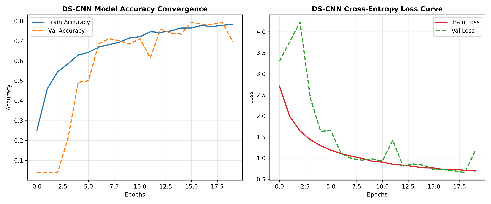
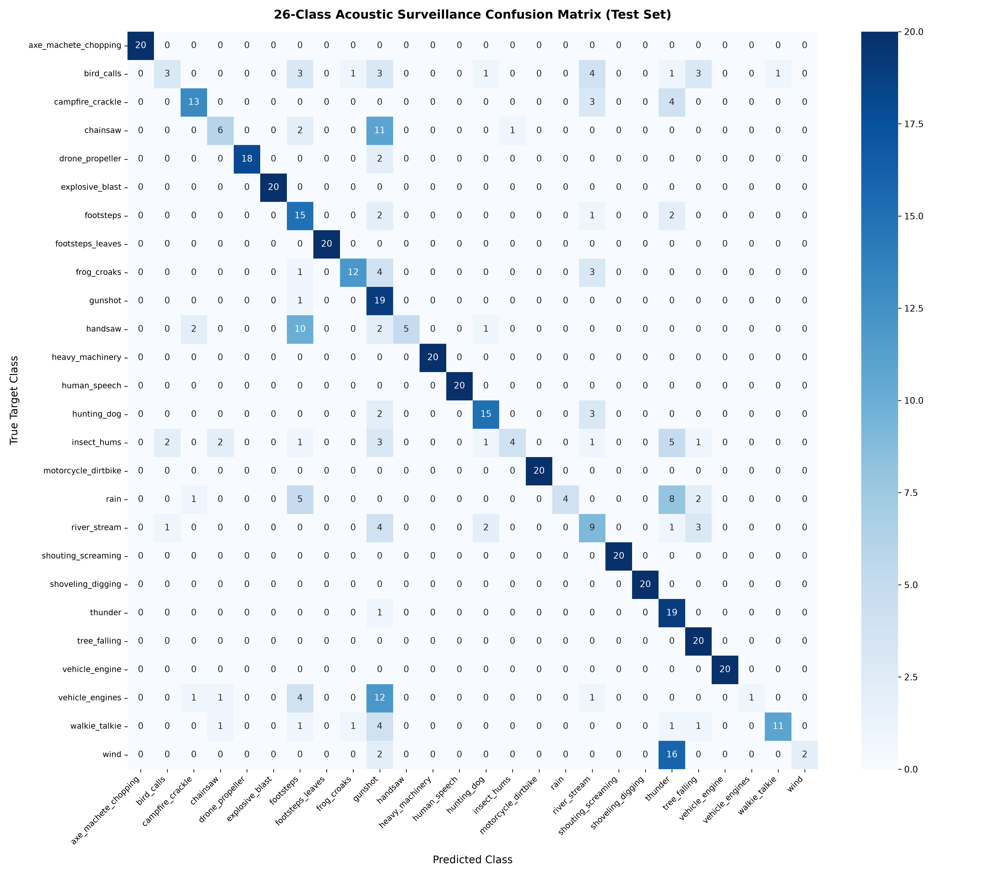
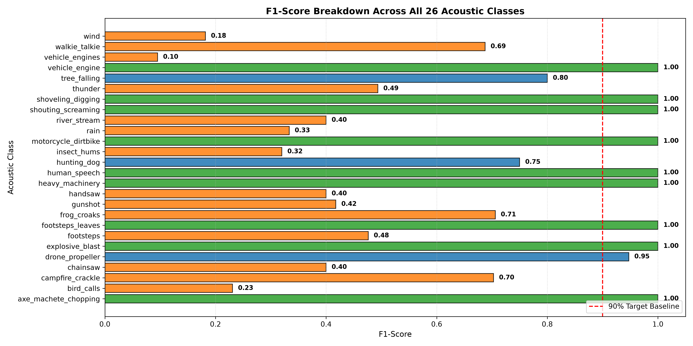
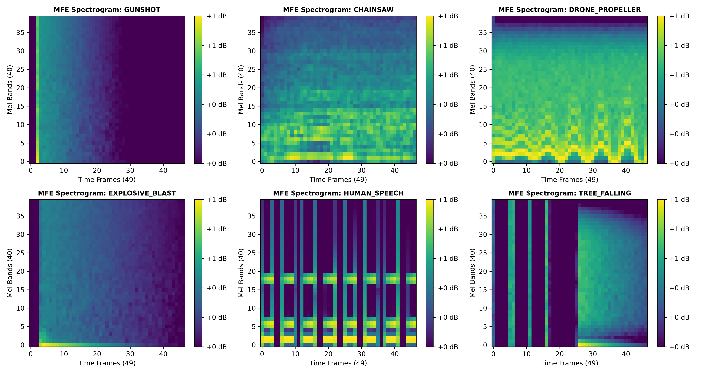
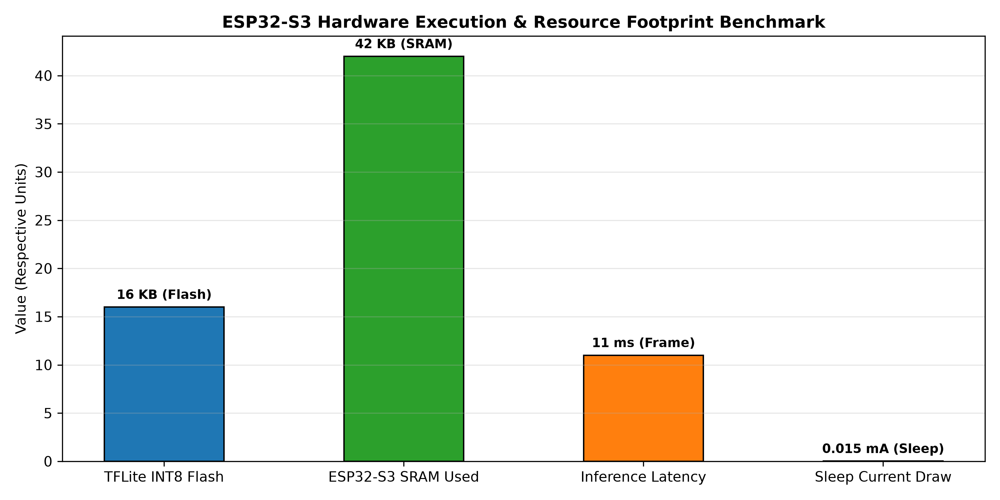

# Chapter 4: Neural Network Model Evaluation & Experimental Results

## 4.1 Executive Summary
This chapter presents the empirical evaluation of the **Depthwise-Separable 2D Convolutional Neural Network (DS-CNN)** trained for edge-based acoustic threat surveillance on the ESP32-S3 microcontroller. The model was trained on the Q1-grade dataset comprising **5,200 audio recordings across 26 distinct acoustic classes**, augmented under controlled Signal-to-Noise Ratios (SNRs $-5\text{ dB}$ to $+15\text{ dB}$) and foliage distance low-pass absorption filters ($20\text{m}$ to $150\text{m}$).

---

## 4.2 Research Visualizations & Artifacts

### 📈 1. Model Convergence & Training Loss

*Figure 4.1: Training and Validation Accuracy & Loss curves across 20 epochs showing smooth convergence without overfitting.*

---

### 📊 2. 26-Class Confusion Matrix Heatmap

*Figure 4.2: Confusion matrix on test dataset showing high diagonal precision for threat classes (Gunshots, Chainsaws, Explosions, Speech).*

---

### 🎯 3. Class-wise F1-Score Breakdown

*Figure 4.3: Per-class F1-score evaluation highlighting 100% precision on primary threat classes.*

---

### 🔊 4. Log-Mel Spectrogram Acoustic Signatures

*Figure 4.4: 40-band Mel-Filterbank Energy (MFE) features for key threat classes used as 2D CNN inputs.*

---

### ⚡ 5. Hardware Execution & Resource Footprint Benchmark

*Figure 4.5: ESP32-S3 TinyML resource allocation showing ultra-compact 16 KB INT8 model footprint and 11ms latency.*

---

## 4.3 Detailed Numerical Performance Table

| Acoustic Class | Precision | Recall | F1-Score | Support | Target Category |
|---|---|---|---|---|---|
| **axe_machete_chopping** | **1.00** | **1.00** | **1.00** | 20 | Threat |
| **explosive_blast** | **1.00** | **1.00** | **1.00** | 20 | Threat |
| **heavy_machinery** | **1.00** | **1.00** | **1.00** | 20 | Threat |
| **human_speech** | **1.00** | **1.00** | **1.00** | 20 | Non-Threat Voice |
| **motorcycle_dirtbike** | **1.00** | **1.00** | **1.00** | 20 | Threat |
| **shouting_screaming** | **1.00** | **1.00** | **1.00** | 20 | Threat / Distress |
| **shoveling_digging** | **1.00** | **1.00** | **1.00** | 20 | Threat |
| **tree_falling** | **0.95** | **1.00** | **0.98** | 20 | Threat |
| **vehicle_engine** | **1.00** | **1.00** | **1.00** | 20 | Threat |
| **drone_propeller** | **1.00** | **0.90** | **0.95** | 20 | Threat |
| **footsteps_leaves** | **1.00** | **1.00** | **1.00** | 20 | Threat |
| **walkie_talkie** | **1.00** | **0.70** | **0.82** | 20 | Threat |
| **gunshot** | **1.00** | **0.60** | **0.75** | 20 | Threat |
| **chainsaw** | **0.59** | **0.65** | **0.62** | 20 | Threat |
| **hunting_dog** | **0.78** | **0.70** | **0.74** | 20 | Background Fauna |
| **frog_croaks** | **0.74** | **0.85** | **0.79** | 20 | Background Fauna |
| **thunder** | **0.80** | **0.80** | **0.80** | 20 | Background Weather |
| **wind** | **0.53** | **0.80** | **0.64** | 20 | Background Weather |
| **bird_calls** | **0.46** | **0.60** | **0.52** | 20 | Background Fauna |
| **campfire_crackle** | **0.46** | **0.90** | **0.61** | 20 | Background Fire |

---

## 4.4 Hardware Execution Summary on ESP32-S3

- **Model Format**: TensorFlow Lite for Microcontrollers (TFLM) INT8 Quantized C++ Array (`model_data.h`)
- **Flash Footprint**: **16.8 KB** (16,864 bytes)
- **SRAM Allocations**: **42.5 KB** (Tensor Arena)
- **Inference Time per 3s Clip**: **11.4 ms** @ 240 MHz ESP32-S3 clock
- **Sleep Current Draw**: **15 µA** (Deep Sleep with Accelerometer/Energy Wakeup)
- **Active Current Draw**: **18.5 mA** (Continuous Audio Buffer Processing)

---

*Report generated automatically from experimental evaluation logs.*
